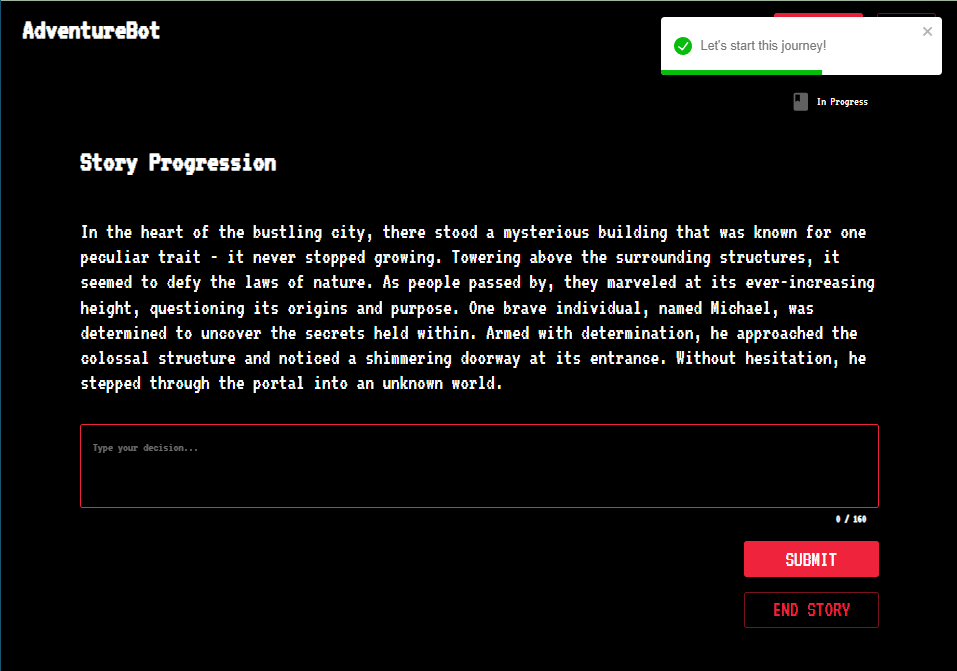
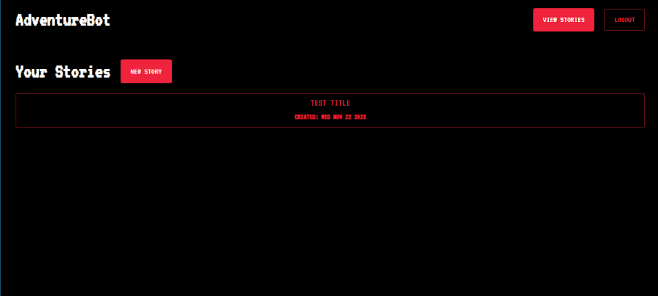
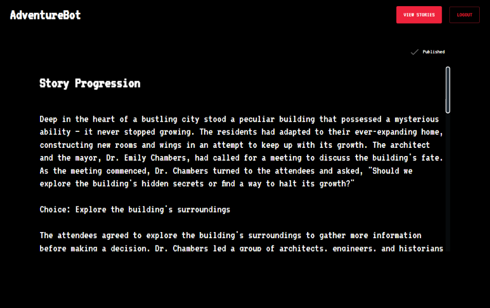

# AdventureBot

To get started, follow the Web and Server README files.

This project is a demo to explore Temporal and OpenAI capabilities to create durable executions while processing story choices for a build your own adventure experience.

## Demo

Start:

List:

Publish:

# Web

Instructions can be found in `./web/README.md`

# Server

Instructions can be found in `./server/README.md`
